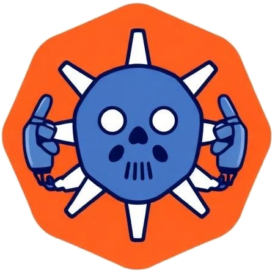
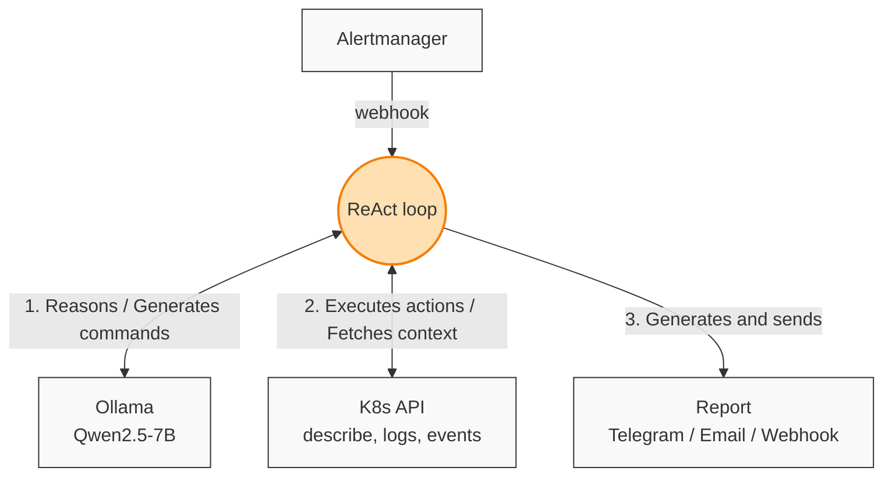

<div align="center">
  

  # SREngine

  <!-- Базовые бейджи (CI, Загрузки, Лицензия) -->
  [](https://github.com/rus-99-pk/srengine/actions/workflows/ci.yaml)
  [](https://github.com/rus-99-pk/srengine/releases)
  [](https://github.com/rus-99-pk/srengine/blob/main/LICENSE)
  <br/>
  <!-- Дополнительные полезные бейджи для Go-проекта (опционально) -->
  [](https://goreportcard.com/report/github.com/rus-99-pk/srengine)
  [](https://github.com/rus-99-pk/srengine/stargazers)

  **An AI-powered SRE agent that automatically investigates Kubernetes alerts.**
</div>

<br/>

When Alertmanager fires — SREngine collects data from your cluster, runs it through a local LLM, and sends back a report with root cause and recommended actions. No GPU required.

## How it works



## Install

Follow this **[link](https://rus-99-pk.github.io/srengine/)** for installation instructions.

Point Alertmanager at the webhook:

```yaml
receivers:
  - name: srengine
    webhook_configs:
      - url: http://srengine.srengine.svc.cluster.local:8080/webhook
```

## Local Development & Testing

We use `make` to manage local environments and tests. Make sure you have a local Ollama instance running.

### 1. Start the Agent

You can run the agent locally against your current cluster:
```bash
export KUBECONFIG=~/.kube/config
export NAMESPACES=default,production
export OLLAMA_URL=http://localhost:11434

make run
```

**Or, use an ephemeral `kind` cluster (Recommended for testing):**
```bash
# Starts kind, prepares namespaces, and runs the agent
make run-kind

# Or start kind + Prometheus + agent
make run-kind-full
```

### 2. Run Integration Tests

Leave the agent running in the **first terminal**. Open a **second terminal** to trigger the tests:

```bash
# Run all test scenarios
make test

# Run a specific scenario (e.g., OOM, crashloop, liveness)
make test-scenario SCENARIO=test-high-memory
```

### Makefile Commands

Run `make help` to see all available commands:
* `make cluster-reset` — Recreates the kind cluster from scratch.
* `make cluster-down` — Deletes the kind cluster to free up resources.
* `make clean` — Clears test cache and built binaries.

## Configuration

All parameters are in [`helm/srengine/values.yaml`](helm/srengine/values.yaml).

Environment variables for local dev — see [`internal/config/config.go`](internal/config/config.go).
